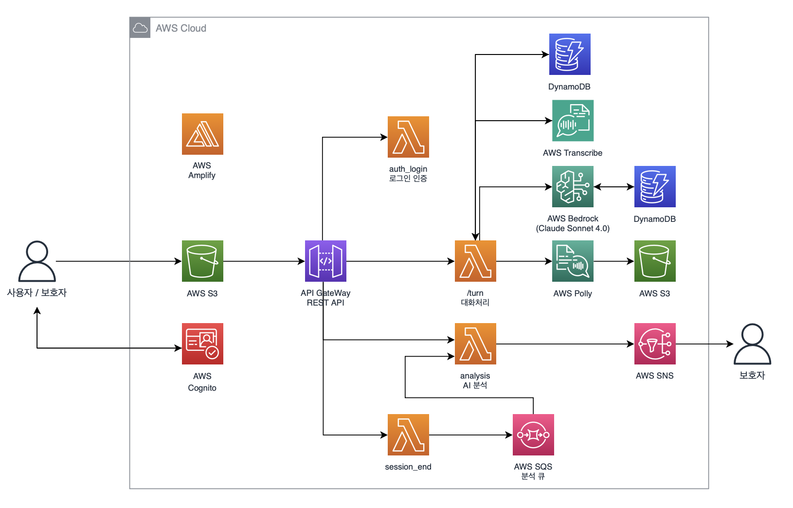

# 똑똑똑

> AWS 서버리스 기반 시니어 음성 AI 케어 플랫폼

똑똑똑은 시니어와 보호자를 위한 AWS 서버리스 기반 음성 AI 케어 플랫폼입니다. 사용자의 음성 대화를 STT, LLM, TTS 파이프라인으로 처리하고, 대화/문진/활동 데이터를 보호자 대시보드와 알림 흐름으로 연결했습니다.

## Tech Stack

**Frontend**


**Backend / AI**


**AWS Cloud**


## Architecture



1. 사용자는 React/Vite PWA에 접속하고 Cognito 기반 로그인 또는 회원가입을 수행합니다.
2. 프론트엔드는 API Gateway REST API를 통해 인증, 세션, 대화, 음성 인식, 활동 기록 API를 호출합니다.
3. 음성 입력은 브라우저가 Transcribe Streaming WebSocket에 직접 연결하도록 Lambda가 presigned URL을 발급합니다.
4. `/turn` Lambda는 최근 대화와 KDSQ 정책을 바탕으로 Bedrock을 호출하고, 응답을 Polly로 합성한 뒤 S3 presigned URL을 반환합니다.
5. 대화, KDSQ 응답, 자가 문진, 활동 로그는 DynamoDB 테이블에 분리 저장됩니다.
6. `/session/end`는 분석 요청을 SQS에 넣고, 분석 Lambda가 대화/KDSQ/활동 데이터를 요약해 필요 시 SNS로 보호자에게 알립니다.

## 핵심 기여

- **AWS 서버리스 아키텍처 설계:** API Gateway, Lambda, DynamoDB, S3, SQS, SNS, Cognito, Bedrock, Polly, Transcribe를 조합해 음성 대화와 보호자 알림 흐름을 구성했습니다.
- **인증 경계 구현:** Cognito User Pool과 API Gateway Authorizer를 연결하고, 사용자 API에 JWT 기반 인증을 적용했습니다.
- **실시간 음성 입력 전환:** Lambda가 Transcribe Streaming presigned URL을 발급하고, 브라우저가 WebSocket으로 직접 음성 스트림을 전달하는 구조를 구현했습니다.
- **AI 대화 정책 정리:** Bedrock 호출 전 KDSQ 질문 정책, 반복 제한, 진단 표현 방지, fallback 응답을 서버에서 통제하도록 구성했습니다.
- **TTS 응답 파이프라인 구현:** Polly 음성 합성 결과를 S3에 저장하고 presigned URL로 프론트엔드에 반환했습니다.
- **비동기 분석/알림 분리:** 세션 종료 후 SQS 큐에 분석 작업을 넣고, 별도 Lambda가 DynamoDB 데이터를 집계해 SNS 알림을 발송하도록 분리했습니다.
- **운영 관측성 확보:** Bedrock, Polly, Transcribe, SQS, Lambda 오류와 fallback 지표를 CloudWatch metric, alarm, dashboard로 확인할 수 있게 했습니다.

## Result

| 개선 영역 | 기존 한계 | 적용 방식 | 결과 |
|---|---|---|---|
| 음성 입력 | 브라우저 음성 인식 지원 여부에 의존 | Transcribe Streaming presigned URL 발급 | 브라우저 지원 차이를 AWS STT 경로로 보완 |
| 대화 응답 | 텍스트 응답 중심 상호작용 | Bedrock 응답 + Polly 음성 합성 + S3 presigned URL | 시니어 사용자를 위한 음성 대화 UX 구성 |
| 분석 처리 | 세션 종료와 분석/알림이 같은 흐름에 묶일 수 있음 | SQS 기반 비동기 분석 Lambda 분리 | 사용자 응답 경로와 보호자 알림 경로 분리 |
| 데이터 저장 | 대화/문진/활동 데이터 경계가 불명확 | DynamoDB 테이블을 목적별로 분리 | 보호자 대시보드와 주간 요약에 필요한 데이터 조회 구조 정리 |
| 운영 관리 | AI/음성 서비스 실패 추적 어려움 | CloudWatch metric/alarm/dashboard 추가 | Bedrock, Polly, Transcribe 실패와 fallback 관찰 가능 |

## Conversation Pipeline

똑똑똑의 대화 흐름은 시니어 사용자의 음성 입력부터 보호자 알림까지 이어집니다.

1. 프론트엔드가 `/start`로 대화 세션을 생성합니다.
2. 사용자가 말하면 프론트엔드는 `/transcribe/stream-url`로 Transcribe Streaming URL을 발급받습니다.
3. 브라우저는 Transcribe Streaming WebSocket으로 음성 chunk를 보내고 최종 transcript를 만듭니다.
4. 프론트엔드는 `/turn`에 transcript를 전달합니다.
5. Lambda는 최근 대화와 KDSQ 정책을 구성해 Bedrock에 전달합니다.
6. Bedrock 응답은 Polly로 합성되고, 음성 파일은 S3 `polly/` prefix에 저장됩니다.
7. 프론트엔드는 assistant text와 audio URL을 받아 사용자에게 보여주고 재생합니다.
8. 세션 종료 시 `/session/end`가 SQS에 분석 작업을 넣고, 분석 Lambda가 보호자 알림 필요 여부를 판단합니다.

## Data Model

| 테이블 / 저장소 | 역할 |
|---|---|
| `UsersTable` | 사용자 프로필, 보호자 이메일, Cognito username, 보호자 PIN 정보 저장 |
| `SessionsTable` | 대화 세션, KDSQ 진행 상태, 분석 상태 저장 |
| `TurnsTable` | 사용자 발화와 AI 응답, 응답 태그, timestamp 저장 |
| `KdsqResponsesTable` | 대화 중 수집된 KDSQ 기반 응답과 질문 유형 저장 |
| `SelfAssessmentsTable` | 자가 문진 응답, 점수, 7일 평균, 알림 여부 저장 |
| `ActivityTable` | 채팅/게임 활동 시간, 점수, 게임 유형 저장 |
| `S3 polly/` | Polly 음성 합성 결과 저장, 7일 lifecycle 적용 |
| `S3 transcribe-input/`, `transcribe-output/` | Transcribe batch fallback 입력/결과 저장, 1일 lifecycle 적용 |

## 주요 기능

- 시니어/보호자 계정 흐름과 보호자 PIN 검증
- 음성 기반 AI 대화, STT/TTS 연동, 텍스트 fallback 입력
- KDSQ 기반 질문 삽입과 진단 표현 방지 정책
- 카드 매칭, 숫자 기억, 빠른 계산, 색상 인식, Kiro 퍼즐 두뇌 게임
- 보호자 대시보드에서 주간 대화/게임 활동, KDSQ 신호, 우려 예시 확인
- 자가 문진 점수와 보호자 알림 기준 관리
- CloudWatch 기반 Lambda/AI/음성 처리 관측성

## Local Development

Frontend:

```bash
cd frontend
npm install
npm run dev
```

Backend:

```bash
cd infra
sam build
sam deploy --profile noin-dev --region ap-northeast-2
```

기본 API URL은 [frontend/lib/api.ts](frontend/lib/api.ts)의 `DEFAULT_API_BASE_URL` 또는 `VITE_API_BASE_URL` 환경 변수로 조정합니다.

## Quality Check

```bash
cd frontend
npm run build

cd ..
python3 -m compileall -q backend

cd infra
sam validate --lint
```

## Deployment

백엔드는 AWS SAM으로 배포합니다.

```bash
cd infra
sam build
sam deploy --profile noin-dev --region ap-northeast-2
```

프론트엔드는 정적 빌드 산출물을 AWS Amplify Hosting 또는 정적 호스팅 환경에 연결해 배포합니다.

```bash
cd frontend
npm run build
```

`BedrockModelId`, `BedrockInvokeResourceArn`, `OpsAlertEmail` 등 배포 파라미터는 [infra/template.yaml](infra/template.yaml)과 [infra/README.md](infra/README.md)를 기준으로 조정합니다.

## Team

<table>
  <tbody>
    <tr>
      <td><strong>강옥일</strong><br/>AWS Architecture / Full-stack<br/>AWS 서버리스 아키텍처 설계, SAM 인프라 구성, Lambda API 구현, Bedrock/Polly/Transcribe 연동, 프론트엔드 음성 대화 흐름 통합</td>
    </tr>
  </tbody>
</table>
